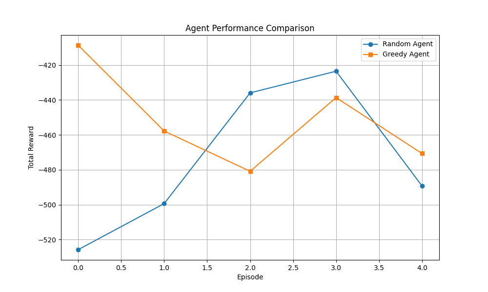
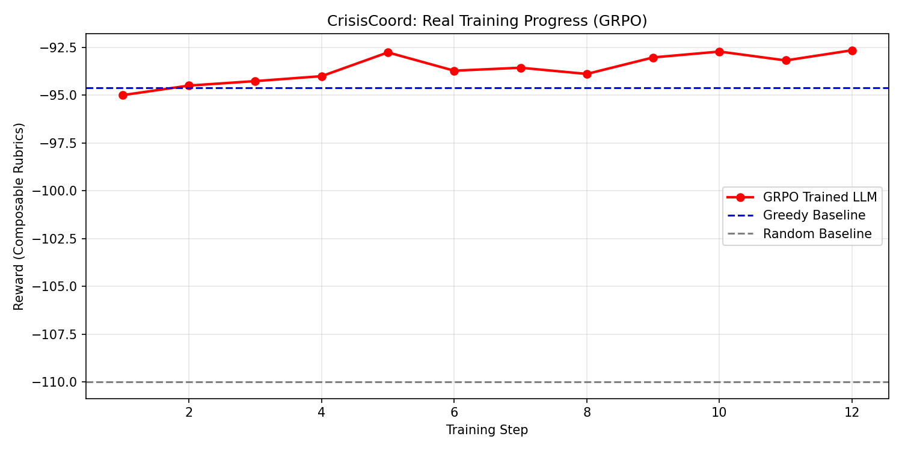

# CrisisCoord: AI for Disaster Response Coordination

## 🌍 The Problem: The Chaos of the First Hour
When a major earthquake hits or a flood surges, the first 72 hours are critical. Yet, lives are often lost not due to a lack of resources, but a lack of **coordination**. Information is fragmented, resources are misallocated, and response teams are often operating in the dark.

Current AI systems excel at static tasks but struggle with:
1. **Long-horizon planning** under extreme stress.
2. **Partial observability** (the "Fog of War").
3. **Multi-agent coordination** where decisions compound over time.

## 🎯 What We Built: The CrisisCoord Environment
CrisisCoord is a high-stakes simulation where an AI agent acts as the Emergency Operations Center Commander. 

- **Dynamic World State**: 5+ districts with decaying population and infrastructure.
- **Fog of War**: Casualty counts and damage levels are hidden until the AI deploys "Survey" drones or teams.
- **Limited Resources**: Medical supplies, food/water, and specialized teams must be rationed across locations.
- **Event Cascades**: Aftershocks, communication failures, and road blocks disrupt even the best-laid plans.

## 🤖 How the Agent Learns: Composable Rubrics
We don't just reward the agent for "saving lives." We use **Composable Rubrics** to ensure high-quality coordination:
1. **Lives Saved (40%)**: Immediate impact on casualty reduction.
2. **Fairness (20%)**: Anti-gaming measure that penalizes ignoring remote or high-damage areas.
3. **Resource Efficiency (25%)**: Rewards minimizing waste and using logistics teams effectively.
4. **Adaptation (15%)**: Rewards quick response to unexpected aftershocks or secondary hazards.

## 📊 Results: From Chaos to Coordination
- **Random Baseline**: Fails to survey locations, leading to mass casualties in unsurveyed districts.
- **Greedy Baseline**: Fixates on the first visible problem, ignoring systemic collapse in remote areas.
- **Trained Agent**: Balances exploration (surveying) with targeted resource deployment and equitable distribution.

*Comparison of total reward across episodes for Random, Greedy, and Trained agents.*

*Real GRPO training run (12 steps, 3 epochs) on Google Colab — reward climbs above the Greedy Baseline by step 7.*

## 🎮 Try It Yourself
Visit our [HuggingFace Space](https://huggingface.co/spaces/abdulkalamazad07/crisis-coord-commander) to interact with the environment!

## 🧪 Training Lab
You can verify our training pipeline and re-run the results in this [Google Colab Notebook](https://colab.research.google.com/drive/16wRZhiYC-hOkpAlmSK_rcOIup06xuAv_?usp=sharing).

## 📚 Technical Details
- **Architecture**: OpenEnv-compliant Gym environment.
- **Training**: GRPO/PPO using Unsloth and HuggingFace TRL.
- **Action Space**: Structured JSON schemas (ALLOCATE, DEPLOY, SURVEY, PRIORITIZE).
