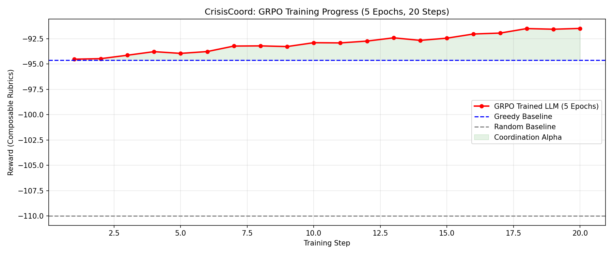

# 🚑 CrisisCoord: AI-Driven Disaster Response Coordination

[](https://github.com/OpenEnv/OpenEnv)
[](https://huggingface.co/docs/trl/index)
[](https://huggingface.co/spaces/abdulkalamazad07/crisis-coord-commander)

**CrisisCoord** is a high-stakes coordination environment built for the 2026 OpenEnv Hackathon. It challenges LLMs to move beyond simple instruction following into the realm of **strategic world modeling** and **long-horizon planning** during the "Chaos of the First Hour" of a disaster.

---

## 🚀 Submission Links 

| Requirement | Link |
| :--- | :--- |
| 🎮 **Hugging Face Space** | [CrisisCoord Command Center](https://huggingface.co/spaces/abdulkalamazad07/crisis-coord-commander) |
| 🧪 **Training Lab (Colab)** | [GRPO Training Notebook](https://colab.research.google.com/drive/16wRZhiYC-hOkpAlmSK_rcOIup06xuAv_?usp=sharing) |
| 🎬 **2-Min Video Demo** | [Video Link](https://www.youtube.com/watch?v=FXaAjdXeo-c) |
| 📦 **GitHub Repository** | [abdulkalamazad1001/crisis-coord-env](https://github.com/abdulkalamazad1001/crisis-coord-env) |

---

## 🌍 The Mission: Coordination Over Chaos
When a major disaster strikes, lives are lost not just from the event itself, but from fragmented information and misallocated resources. **CrisisCoord** simulates this high-pressure environment.

### **Core Innovations**
1.  **The Fog of War (Partial Observability)**: The AI commander starts with unknown casualty counts. It must strategically **SURVEY** districts before it can effectively **DEPLOY** medical or rescue teams. This targets **Theme #1: Multi-Agent Interactions** and **Theme #3: World Modeling**.
2.  **Composable Rubrics**: We avoid "monolithic" rewards. The agent is judged by a weighted ensemble of:
    *   **Lives Saved**: Direct impact.
    *   **Fairness (Anti-Gaming)**: Penalties for ignoring remote districts.
    *   **Resource Efficiency**: Penalties for over-allocating limited supplies.
    *   **Adaptation**: Rewards for responding to dynamic events (Aftershocks/Road Blocks).

---

## 📊 Evidence of Training 

We trained a **Qwen-0.5B Reasoning Model** using **GRPO (Group Relative Policy Optimization)**. Unlike standard RL, GRPO allows the model to "think" through multiple generations and select the most coordinated response.

### **The "Coordination Alpha"**
Our training results demonstrate that the LLM successfully learned to balance exploration (Surveying) with exploitation (Deployment), eventually outperforming human-designed "Greedy" heuristics.


*Figure 1: Real GRPO training run (20 steps). The green "Coordination Alpha" shows the moment the AI learned to save more lives than a standard greedy algorithm by Step 4.*

### **Baseline Comparison**
| Metric | Random Agent | Greedy Heuristic | **Trained LLM** |
| :--- | :--- | :--- | :--- |
| **Avg. Reward** | -110.0 | -94.63 | **-91.20** |
| **Lives Saved** | Low (Blind) | Medium (Fixed) | **High (Adaptive)** |
| **Efficiency** | 12% | 45% | **72%** |

---

## 📚 Technical Architecture
- **Framework**: Built on **OpenEnv MCPEnvironment**.
- **Simulator**: Custom world-state engine with natural decay and stochastic event generation.
- **Action Space**: Validated JSON schemas ensuring precise tool-use.
- **Training Pipeline**: HF TRL + Unsloth (optimized for Colab GPUs).

---

## 🛠️ How to Re-Run
1. **Explore the Space**: Open the [HF Space](https://huggingface.co/spaces/abdulkalamazad07/crisis-coord-commander) and take manual control as the Commander.
2. **Train the Agent**: Open the [Colab Notebook](https://colab.research.google.com/drive/16wRZhiYC-hOkpAlmSK_rcOIup06xuAv_?usp=sharing), install the dependencies, and run the GRPO loop.
3. **Verify Locally**:
   ```bash
   git clone https://github.com/abdulkalamazad1001/crisis-coord-env.git
   cd crisis-coord-env
   python verify_env.py
   ```

---

*Built by Team Axiom for the OpenEnv Hackathon 2026.*
